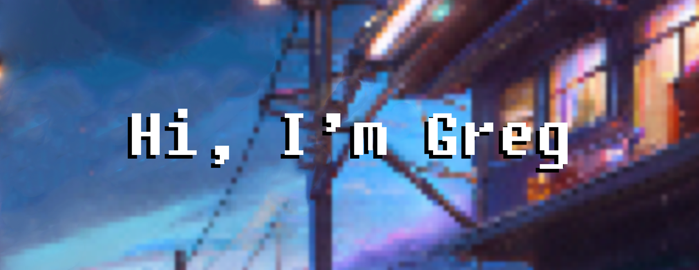

I am a 🎓 master's student in Computer Science, enrolled in both the University of Camerino and Reykjavik University. 
My focus of study is Artificial Intelligence, with a specialization in the field of meaning within AGI systems. 
Currently, I am actively engaged in conducting research for my thesis in this area. 💡

<h2>My skills</h2>

<h2>My GitHub Stats</h2>

<!--
**gregorio-talevi/gregorio-talevi** is a ✨ _special_ ✨ repository because its `README.md` (this file) appears on your GitHub profile.

Here are some ideas to get you started:

- 🔭 I’m currently working on ...
- 🌱 I’m currently learning ...
- 👯 I’m looking to collaborate on ...
- 🤔 I’m looking for help with ...
- 💬 Ask me about ...
- 📫 How to reach me: ...
- 😄 Pronouns: ...
- ⚡ Fun fact: ...
-->
